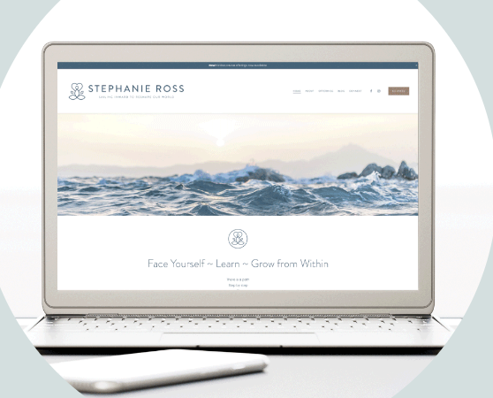
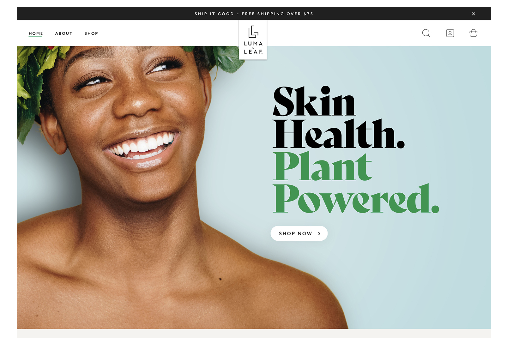
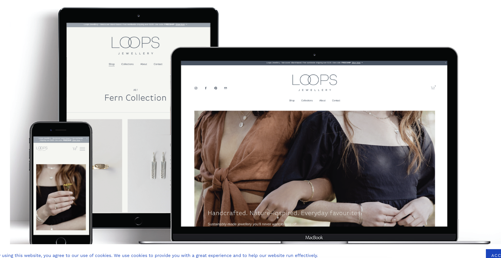

# Project Website Plan Content

## Project Summary

* State what site you have chosen to redesign and build and include the URL.
    I have chosen to redesign and build the Kehler Vegetables website. https://www.kehlervegetables.ca/

* Explain why the client needs a new website:
  * What is the most important purpose of this website?
      The most important purpose of this website is to advertise their fresh produce and to gain a wider customer base.

  * Who is the target audience? Perhaps there are multiple target audiences?
      Anyone who is looking for fresh, local produce and who cares about where their food comes from and how it’s grown. This audience is also 
      likely interested in organic produce that is free of pesticides with emphasis on supporting a farm that focuses on the environment and 
      sustainability. This demographic can include anywhere from a young, independent professional to a young and growing family. 

  * What is the overall message you are trying to convey to your target audience on this website? 
      The overall message I will be conveying is that the farm instills best sustainable practises and displaying their large and fresh       
      assortment of produce available.

  * What action do you want the audience to perform before they leave your website? Are there multiple ways they could take action?
      I want the audience to feel compelled to want to shop at Kehler Vegetables. This can be made simple to the audience by establishing 
      awareness of the farm and their location and a good understanding of what is available for purchase. I would do this by clearly displaying 
      produce via images and prices, all while ensuring good readability, legibility, and accessibility practices.

  * Why is their current site not appropriate? There could be many reasons to do with accessibility, speed, design, content, or responsiveness.
      Their current site is not appropriate because overall it doesn’t look polished— from how the elements are displayed on the page to the           lack of content. This lack of content could disengage consumers since consumers want to know exactly what is available to them, what they        are getting, and for how much. So if this information is not clearly detailed, they will likely lose potential consumers that happen upon        the website.

## Look and Feel

Describe how you will approach the design elements of the website.

**Mood:** What are some specific visual moods the site should convey?
      I believe the website should have a clean and minimal look. This is usually the best way to display content and have it be easy for the 
      consumer to browse and navigate. Additionally, it's worth noting that the typical audience for farmers' markets and those who buy local 
      produce, often favour a minimalist style, reflected in their clothing choices and the reusable totes or mesh produce bags they carry.

**Inspiration:** Research and include homepage screenshots and urls of 2 website designs that you feel are good inspiration for the redesign of your website because they communicate similar moods to what you want your website to convey.

Here are a few examples of homepage screenshots portraying the look and feel I am going for with my website redesign.

 
https://www.stephanierossauthor.com/

 
https://lumaandleaf.com/

 
https://www.loopsjewellery.com/

**Colours:** Are there any brand colours that you can use? List at least 3 colours that you plan to use in your redesign.
The brand colours I plan on using in my redesign are forest green #233b34, gold #9f793a or #af8645, grey #333333 or #2E2E2E, peach #FCCAB0 or #FBBE9D, cream #F5EBE0 or #FAF5F0 or #FFFFFF. I have 5-6 colours listed here, but I don't plan on using all of them-- I just wanted options of colours that work well together. Additionally, I will use certain colours sparignly so it doesn't look too chaotic.

**Images:** Is there a logo, photos, icons or illustrations that can be used from the original site?
Yes, the site has a logo I can work with and an abundance of photos displayed on their original website.

**Fonts:** Are there any brand typefaces that you can reuse? List 2 font-families that you plan to use in your redesign.
It seems as though there are 1 or 2 typefaces included but nothing definitive or distinct.
I would like to use Lora for body text and Playfair Display for headings and Open Sans as a third backup option.

## Website Content

You only need to build 3 pages, including the homepage. For those 3 pages write a content list for each page. 
Review the Website Technical Requirements from the Project Overview document to ensure that you have included all the content you need.
Once you know what content you will include in your website, you can use wireframes to figure out what each content block’s layout could look like.
